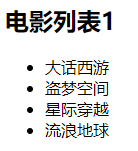
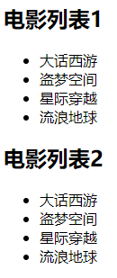
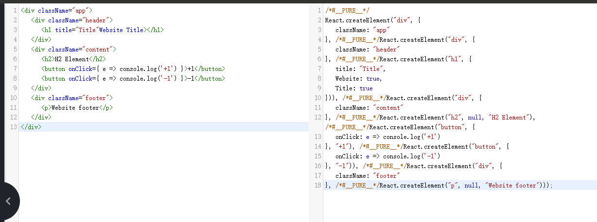
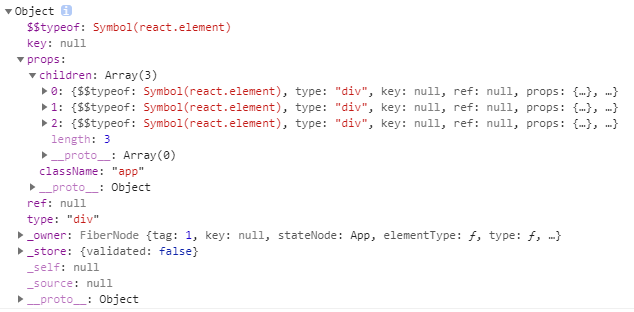
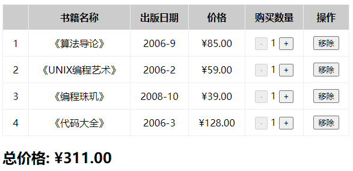

# JSX 原理和基本语法

## 参考资料

- [React总结7:Each child in an array or iterator should have a unique "key" prop.的处理方法](https://blog.csdn.net/juzipchy/article/details/74834973)
- [snippet generator](https://snippet-generator.app/)

## 电影列表展示

> Emmt语法：`ul>li{电影$}*5`
>
> ```html
> <ul>
>   <li>电影1</li>
>   <li>电影2</li>
>   <li>电影3</li>
>   <li>电影4</li>
>   <li>电影5</li>
> </ul>
> ```

*01-jsx-movie-list.html*

```jsx
<!DOCTYPE html>
<html lang="en">
<head>
  <meta charset="UTF-8">
  <meta name="viewport" content="width=device-width, initial-scale=1.0">
  <title>JSX Movie List</title>
</head>
<body>
  <div id="app"></div>

  <script src="./react/react.development.js" crossorigin></script>
  <script src="./react/react-dom.development.js" crossorigin></script>
  <script src="./react/babel.min.js"></script>
  <script type="text/babel">

    class App extends React.Component {

      constructor() {
        super();

        this.state = {
          title: '电影列表',
          movies: [
            '大话西游',
            '盗梦空间',
            '星际穿越',
            '流浪地球'
          ]
        }
      }

      render() {

        const liList = [];
        for (const movie of this.state.movies) {
          liList.push(<li>{movie}</li>);
        }

        return (
          <div>
            <h2>{this.state.title}</h2>
            <ul>
              {liList}
            </ul>
          </div>
        )
      }

    }

    ReactDOM.render(<App/>, document.getElementById('app'));
  </script>
</body>
</html>
```

 

*01-jsx-movie-list.html*

```jsx
<!DOCTYPE html>
<html lang="en">
<head>
  <meta charset="UTF-8">
  <meta name="viewport" content="width=device-width, initial-scale=1.0">
  <title>JSX Movie List</title>
</head>
<body>
  <div id="app"></div>

  <script src="./react/react.development.js" crossorigin></script>
  <script src="./react/react-dom.development.js" crossorigin></script>
  <script src="./react/babel.min.js"></script>
  <script type="text/babel">

    class App extends React.Component {

      constructor() {
        super();

        this.state = {
          title: '电影列表',
          movies: [
            '大话西游',
            '盗梦空间',
            '星际穿越',
            '流浪地球'
          ]
        }
      }

      render() {

        const liList = [];
        let i = 0;
        for (const movie of this.state.movies) {
          liList.push(<li key={i++}>{movie}</li>);
        }

        return (
          <div>
            <h2>{this.state.title + '1'}</h2>
            <ul>
              {liList}
            </ul>
            <h2>{this.state.title + '2'}</h2>
            <ul>
              {// 表达式
                this.state.movies.map((movie, index) => <li key={index}>{movie}</li>)
              }
            </ul>
          </div>
        )
      }

    }

    ReactDOM.render(<App/>, document.getElementById('app'));
  </script>
</body>
</html>
```

 

## 计数器

*02-jsx-counter.html*

```jsx
<!DOCTYPE html>
<html lang="en">
<head>
  <meta charset="UTF-8">
  <meta name="viewport" content="width=device-width, initial-scale=1.0">
  <title>JSX Counter</title>
</head>
<body>
  <div id="app"></div>
  <script src="./react/react.development.js" crossorigin></script>
  <script src="./react/react-dom.development.js" crossorigin></script>
  <script src="./react/babel.min.js"></script>
  <script type="text/babel">

    class App extends React.Component {

      constructor(props) {
        super(props);

        this.state = {
          counter: 0
        }
      }

      render() {

        return (
          <div>
            <h2>当前计数：{this.state.counter}</h2>
            <button onClick={this.increment.bind(this)}>+1</button>
            <button onClick={this.decrement.bind(this)}>-1</button>
          </div>
        )
      }


      increment() {
        console.log(this);
        console.log('+1');
        this.setState({
          counter: ++this.state.counter
        });
      }

      decrement() {
        console.log(this);
        console.log('-1');
        this.setState({
          counter: --this.state.counter
        });
      }
    }

    ReactDOM.render(<App/>, document.getElementById('app'));
  </script>
  
</body>
</html>
```

 

## 认识 JSX

```jsx
// JSX 语法
const element = <h2>Hello World</h2>;
ReactDOM.render(element, document.getElementById('app'));
```

这段 element 变量的声明右侧赋值的标签语法是什么呢？

- 它不是一段字符串（因为没有使用引号包裹），它看起来是一段 HTML 原生，但是我们能在 js 中直接给一个变量赋值 html 吗？
- 其实是不可以的，如果我们将 `type="text/babel"` 去除掉，那么就会出现语法错误；
- 它到底是什么呢？其实它是一段 jsx 语法；

JSX 是什么？

- JSX 是一种 JavaScript 的语法扩展（extension），也在很多地方称之为 JavaScript XML，因为看起来就是一段 XML 语法；
- 它用于描述我们的 UI 界面，并且可以和 JavaScript 融合在一起使用；
- 它不同于 Vue 中的模块语法，你不需要专门学习模块语法中的一些指令（比如：v-for、v-if、v-else、v-bind）；

## 为什么 React 选择 JSX

React 认为渲染逻辑本质上与其他 UI 逻辑存在内在耦合：

- 比如：UI 需要绑定事件（button、a 原生等等）；
- 比如：UI 需要展示数据状态，在某些状态发生改变时，又需要改变 UI；

他们之间是密不可分，所以 React 没有将标记分离到不同的文件中，而是将它们组合到一起，这个地方就是组件（Component）。

JSX 其实是嵌入到 JavaScript 中一种结构语法，书写规范：

- JSX 的顶层**只能有一个根元素**，所以我们很多时候会在外层包裹一个 div 原生（或者使用后面我们学习的 Fragment）；

- 为了方便阅读，我们通常在 jsx 的外层包裹一个小括号`()`，这样可以方便阅读，并且 JSX 可以进行换行书写；

- JSX 中的标签可以是单标签，也可以是双标签。

  > 注意：如果是单标签，必须以 `/>` 结尾；

## JSX 的使用

### JSX 中的注释

*03.2-jsx-syntax-annotation.html*

```jsx
<script type="text/babel">

  class App extends React.Component {

    constructor(props) {
      super(props);
    }

    render() {

      return (
        <div>
          {/* 我是一段注释 */}
          {
            // 我是一段注释
          }
          <h2>Hello World</h2>
        </div>
      )
    }
  }

  ReactDOM.render(<App/>, document.getElementById('app'));
</script>
```

### JSX 嵌入变量

- 情况一：当变量是 Number、String、Array 类型时，可以直接显示；
- 情况二：当变量是 null、undefined、Boolean 类型时，内容为空；
  - 如果希望可以显示 null、undefined、Boolean ，那么需要转成字符串；
  - 转换的方式有很多，比如：toString() 方法、空字符串拼接 和 String(变量) 等方式；
- 情况三：对象类型不能作为子元素（not valid as a React child）

*03.3-jsx-syntax-variable.html*

```jsx
<script type="text/babel">

  class App extends React.Component {

    constructor(props) {
      super(props);

      this.state = {
        /* 在 {} 中正常显示内容 */
        name: 'Darwin', // String
        age: 18, // Number
        names: ['Darwin', 'Newton', 'Turing'], // Array

        /* 在 {} 中不能显示 */
        null_: null, // null
        undefined_: undefined, // undefined
        true_: true, // Boolean
        false_: false, // Boolean
        flag: true,

        /* 对象不能作为 JSX 的子类 */
        friend: {
          name: 'Einstein',
          age: 40
        }
      }
    }

    render() {Embedded expression


    return (
      <div>
        <h2>{this.state.name}</h2>
        <h2>{this.state.age}</h2>
        <h2>{this.state.names}</h2>
        <h2>{this.state.null_}</h2>
        <h2>{this.state.null_ + ''}</h2>
        <h2>{this.state.undefined_}</h2>
        <h2>{String(this.state.undefined_)}</h2>
        <h2>{this.state.true_}</h2>
        <h2>{this.state.false_.toString()}</h2>
        <h2>{this.state.flag ? 'Hello' : null}</h2>
        <h2>{this.state.flag && 'Hi'}</h2>
        {/* <h2>{this.state.friend}</h2> */}
      </div>
    )
             }
  }

  ReactDOM.render(<App/>, document.getElementById('app'));
</script>
```

### JSX 嵌入表达式

- 运算表达式
- 三元运算符
- 执行一个函数

*03.4-jsx-syntax-embedded-expression.html*

```jsx
<script type="text/babel">

  class App extends React.Component {

    constructor(props) {
      super(props);

      this.state = {
        firstname: 'Charles',
        lastname: 'Darwin',
        isLogin: true
      }
    }

    render() {

      const { firstname, lastname, isLogin } = this.state;

      return (
        <div>
          {/* 运算符表达式 */}
          <h2>{ firstname + ' ' + lastname }</h2>
          <h2>{20 + 50}</h2>

          {/* 三元表达式 */}
          <h2>{ isLogin ? 'Welcome' : 'Login in'}</h2>

          {/* 进行函数调用 */}
          <h2>{ this.getFullName() }</h2>
        </div>
      )
    }

    getFullName() {
      return this.state.firstname + ' ' + this.state.lastname;
    }
  }

  ReactDOM.render(<App/>, document.getElementById('app'));
</script>
```

### JSX 绑定属性

- 比如：元素都会有 title 属性
- 比如：img 元素会有 src 属性
- 比如：a 元素会有 href 属性
- 比如：元素可能需要绑定 class
- 比如：原生使用内联样式 style

*03.5-jsx-syntax-binding-properties.html*

```jsx
<script type="text/babel">

  function getImageBySizes(url, size) {
    return url + `?param=${size}y${size}`;
  }

  class App extends React.Component {

    constructor(props) {
      super(props);

      this.state = {
        title: 'MY TITLE',
        imgUrl: 'http://p1.music.126.net/2dIhCSnv1ZCZM_1OmhB8vA==/109951164359889372.jpg',
        link: 'https://www.baidu.com/',
        active: true
      }
    }

    render() {

      const { title, imgUrl, link, active } = this.state;

      // jsx 关键字：class、for... 等
      return (
        <div>
          {/* 绑定 普通属性 */}
          <h2 title={title}>My Title</h2>
          
          <a href={link} target="_blank">Baidu</a>

          {/* 绑定 class */}
          {/* className -> class */}
          <div className="box title">I am a div element.</div>
          <div className={'box title' + (active ? ' active' : '')}>I am a div element, too.</div>
          {/* htmlFor -> for */}
          <label htmlFor=""></label>

          {/* 绑定 style */}
          <div style={{ color: 'royalblue', fontWeight: 600 }}>I am a div element, binding style.</div>
        </div>
      )
    }
  }

  ReactDOM.render(<App/>, document.getElementById('app'));
</script>
```

### React 事件绑定

如果原生 DOM 有一个监听事件，我们可以如何操作？

- 方式一：获取 DOM原生，添加监听事件；
- 方式二：在 HTML 原生中，直接绑定事件；

在 React 中是如何操作呢？

- 我们来实现一下 React 中的事件监听，这里主要有 2 点不同：
  - React 事件命名采用小驼峰式（camelCase），而不是纯小写；
  - 通过 `{}` 传入一个事件处理函数，这个函数会在事件发生时被执行；

*03.6-jsx-syntax-binding-event.html*

```jsx
<!DOCTYPE html>
<html lang="en">
<head>
  <meta charset="UTF-8">
  <meta name="viewport" content="width=device-width, initial-scale=1.0">
  <title></title>
</head>
<body>
  <div id="app"></div>
  <script src="./react/react.development.js" crossorigin></script>
  <script src="./react/react-dom.development.js" crossorigin></script>
  <script src="./react/babel.min.js"></script>
  <script type="text/babel">

    class App extends React.Component {

      constructor(props) {
        super(props);

        this.state = {
          message: 'Hello World',
        }
      }

      render() {

        return (
          <div>
            <button onClick={this.btnClick}>Btn</button>
          </div>
        )
      }

      btnClick(event) {
        alert(this.state.message)
        console.log(event)
      }
    }

    ReactDOM.render(<App/>, document.getElementById('app'));
  </script>
  
</body>
</html>
```

### this 的绑定问题

在事件执行后，需要获取当前类的对象中相关的属性，这个时候需要用到 this

- 如果我们直接打印 this，也会发现它是一个 undefined

为什么是 undefined 呢？

- 原因是 btnClick 函数并不是我们主动调用的，而且当 button 发生改变时，React 内部调用了 btnClick 函数；
- 而它内部调用时，并不知道要如何绑定正确的 this；

如何解决 this 的问题呢？

- 方案一：bind 给 btnClick 显示绑定 this
- 方案二：使用 ES6 class fields 语法
- 方案三：事件监听时传入箭头函数（推荐）

#### bind 绑定 this（显示绑定）

*03.6-jsx-syntax-binding-event.html*

```jsx
class App extends React.Component {

  constructor(props) {
    super(props);

    this.state = {
      message: 'Hello World',
    }
  }

  render() {

    return (
      <div>
        {/* 方法一 */}
        <button onClick={this.btnClick.bind(this)}>Btn</button>
      </div>
    )
  }

  btnClick(event) {
    alert(this.state.message)
    console.log(event)
  }
}

ReactDOM.render(<App/>, document.getElementById('app'));
```

*03.6-jsx-syntax-binding-event.html*

```jsx
class App extends React.Component {

  constructor(props) {
    super(props);

    this.state = {
      message: 'Hello World',
    }

    /* 方法二 */
    this.btnClick = this.btnClick.bind(this)
  }

  render() {

    return (
      <div>
        {/* 方法一 */}
        {/* <button onClick={this.btnClick.bind(this)}>Btn</button> */}
        <button onClick={this.btnClick}>Btn1</button>
        <button onClick={this.btnClick}>Btn2</button>
        <button onClick={this.btnClick}>Btn3</button>
      </div>
    )
  }

  btnClick(event) {
    alert(this.state.message)
    console.log(event)
  }
}

ReactDOM.render(<App/>, document.getElementById('app'));
```

#### 定义函数使用箭头函数（ES6 class fields 语法）

```jsx
class App extends React.Component {

  constructor(props) {
    super(props);

    this.state = {
      message: 'Hello World',
      counter: 100
    }

    /* 方法一 */
    this.btnClick = this.btnClick.bind(this)
    // this.increment = this.increment.bind(this)

  }

  render() {

    return (
      <div>
        {/* 方式一：：bind 绑定 this（显示绑定） */}
        {/* <button onClick={this.btnClick.bind(this)}>Btn</button> */}
        <button onClick={this.btnClick}>Btn1</button>
        <button onClick={this.btnClick}>Btn2</button>
        <button onClick={this.btnClick}>Btn3</button>

        <button onClick={this.increment}>+1</button>
      </div>
    )
  }

  btnClick(event) {
    alert(this.state.message)
    console.log(event)
  }

  /* increment() {
        console.log(this.state.counter)
      } */
  // 箭头函数不绑定 this
  // ES6 中给对象增加属性：class field
  increment = () => {
    console.log(this.state.counter)
  }
  decrement() {

  }
}

ReactDOM.render(<App/>, document.getElementById('app'));
```

#### 直接传入箭头函数（推荐）

*03.6-jsx-syntax-binding-event.html*

```jsx
class App extends React.Component {

  constructor(props) {
    super(props);

    this.state = {
      message: 'Hello World',
      counter: 100
    }

    /* 方法一 */
    this.btnClick = this.btnClick.bind(this)
    // this.increment = this.increment.bind(this)

  }

  render() {

    return (
      <div>
        {/* 方案一：：bind 绑定 this（显示绑定） */}
        {/* <button onClick={this.btnClick.bind(this)}>Btn</button> */}
        <button onClick={this.btnClick}>Btn1</button>
        <button onClick={this.btnClick}>Btn2</button>
        <button onClick={this.btnClick}>Btn3</button>

        {/* 方案二：定义函数时，使用箭头函数 */}
        <button onClick={this.increment}>+1</button>
        {/* 方案三：直接传入箭头函数，在箭头函数中调用需要执行的函数 */}
        <button onClick={ () => this.decrement() }>-1</button>
      </div>
    )
  }

  btnClick(event) {
    alert(this.state.message)
    console.log(event)
  }

  /* increment() {
        console.log(this.state.counter)
      } */
  // 箭头函数不绑定 this
  // ES6 中给对象增加属性：class field
  increment = () => {
    console.log(this.state.counter)
  }

  decrement() {
    console.log(this.state.counter)
  }
}

ReactDOM.render(<App/>, document.getElementById('app'));
```

### 事件参数传递

在执行事件函数时，有可能我们需要获取一些参数信息，比如：

- event 对象、其他参数

情况一：获取 event 对象

- 很多时候我们需要拿到 event 对象来做一些事情（比如阻止默认行为）
- 假如我们用不到 this，那么直接传入函数就可以获取到 event 对象；

情况二：获取更多参数

- 有更多参数时，最好的方式就是传入一个箭头函数，主动执行的事件函数，并且传入相关的其他参数；

*03.6-jsx-syntax-binding-event-params.html*

```jsx
<script type="text/babel">

  class App extends React.Component {

    constructor(props) {
      super(props);

      this.state = {
        message: 'Hello World',
        movies: ['The Dark Knight', 'Interstellar', 'Inception']
      }

      /* 方法一 */
      this.btnClick = this.btnClick.bind(this)
      // this.increment = this.increment.bind(this)

    }

    render() {

      return (
        <div>
          <button onClick={this.btnClick}>Button</button>
          <ul>
            {
              this.state.movies.map((movie, index) => {
                return (
                  <li onClick={(event) => this.liClick(movie, index, event)} key={index}>{movie}</li>
                )
              })
            }  
          </ul>
        </div>
      )
    }

    btnClick(event) {
      alert(this.state.message)
      console.log(event)
    }

    liClick(movie, index, event) {
      event.persist();
      console.log('[li click]', movie, index, event)
    }
  }

  ReactDOM.render(<App/>, document.getElementById('app'));
</script>
```

### React 条件渲染

在某些情况下，界面的内容会根据不同的情况显示不同的内容，或者决定是否渲染某部分内容：

- 在 vue 中，通过指令来控制：比如 v-if、v-show（切换频率高时使用）
- 在 React 中，所有的条件判断都和普通的 JavaScript代码一致；

常见的条件渲染方式有哪些呢？

- 方式一：条件判断语句
  - 适合逻辑较多的情况
- 方式二：三元运算符
  - 适合逻辑比较简单
- 与运算 &&
  - 适合如果条件成立，渲染某一个组件；
  - 如果条件不成立，什么内容也不渲染；
- v-show 效果
  - 主要是控制 display 属性是否为 none

*03.6-jsx-syntax-if.html*

```jsx
<script type="text/babel">

  class App extends React.Component {

    constructor(props) {
      super(props);

      this.state = {
        isLogin: true
      }
    }

    render() {

      const { isLogin } = this.state

      // 方案1：通过 if 判断
      // （逻辑代码非常多的情况）

      let welcome = <h2>Please login!</h2>
          let btnTitle = 'Login';
      if (this.state.isLogin) {
        welcome = <h2>Welcome back!</h2>
          btnTitle = 'Exit'
      }

      return (
        <div>
          {welcome}
          {/* 方案2：三元运算符 */}
          {/* <button>{btnTitle}</button> */}
          <button onClick={ e => this.loginClick() }>{ isLogin ? 'Exit' : 'Login' }</button>
          <hr/>
          {/* 方案3：逻辑与 && */}
          {/* {isLogin ? <h3>Hello, Darwin!</h3> : null} */}
          {isLogin && <h3>Hello, Darwin!</h3>}
        </div>
      )
    }

    loginClick() {
      this.setState({
        isLogin: !this.state.isLogin
      })
    }
  }

  ReactDOM.render(<App/>, document.getElementById('app'));
</script>
```

*03.6-jsx-syntax-v-show.html*

```jsx
<script type="text/babel">

  class App extends React.Component {

    constructor(props) {
      super(props);

      this.state = {
        isLogin: true
      }
    }

    render() {

      const { isLogin } = this.state
      let titleDisplayValue = isLogin ? 'block' : 'none'

      return (
        <div>
          <h2 style={{ display: titleDisplayValue }}>Hello, Darwin</h2>
          <button onClick={() => this.loginClick()}>{isLogin ? 'Exit' : 'Login'}</button>
        </div>
      )
    }

    loginClick() {
      this.setState({
        isLogin: !this.state.isLogin
      })
    }
  }

  ReactDOM.render(<App/>, document.getElementById('app'));
</script>
```

### React 列表渲染

真实开发中我们会从服务器请求到大量的数据，数据会以列表的形式存储：

- 比如：歌曲、歌手、排行榜列表的数据；
- 比如：商品、购物车、评论列表的数据；
- 比如：好友消息、动态、联系人列表的数据；

在 React 中并没有像 Vue 模块语法中的 `v-for` 指令，而且需要我们通过 JavaScript 代码的方式组织数据，转成 JSX：

- 很多从 Vue 转型到 React 的同学非常不习惯，认为 Vue 的方式更加简洁明了；
- 但是 React 中的 JSX 正式因为和 JavaScript 无缝的衔接，让它可以更加的灵活；
- 另外，我们经常提到 React 是真正可以提高我们编写代码能力的一种方式；

如何展示列表呢？

- 在 React 中，展示列表最多的方式就是使用数组的 map 高阶函数；

很多时候在展示一个数组中的数据之前，需要先对它进行一些处理：

- 比如：过滤掉一些内容：`filter` 函数
- 比如：截取数组中的一部分内容：`slice` 函数

## JSX 的本质

实际上，JSX 仅仅只是 `React.createElement(component, props, ...children)` 函数的语法糖。

- 所有的 jsx 最终都会被转换成 React.createElement 的函数使用

*03.7-jsx-core-base.html*

```jsx
<!DOCTYPE html>
<html lang="en">
<head>
  <meta charset="UTF-8">
  <meta name="viewport" content="width=device-width, initial-scale=1.0">
  <title>JSX 本质 - 基本使用</title>
</head>
<body>
  <div id="app"></div>
  <script src="./react/react.development.js" crossorigin></script>
  <script src="./react/react-dom.development.js" crossorigin></script>
  <!-- <script src="./react/babel.min.js"></script> -->
  <script>/* type="text/babel" */
    // jsx -> babel -> React.createElement()
    // const message = <h2>Hello React</h2>;
    const message1 = React.createElement('h2', { title: 'Hello React' }, 'Hello React');
    ReactDOM.render(message1, document.getElementById('app'));
  </script>
</body>
</html>
```

**React.createElement 在源码的什么位置呢？**

```
React.createElement
```

源码：*react ((v16.13.1))\packages\react\index.js*

```js
// Export all exports so that they're available in tests.
// We can't use export * from in Flow for some reason.
export {// -> React
  Children,
  createRef,
  Component,
  ...,
  createElement,
  ...
} from './src/React';
```

- *packages\react\src\React.js*

  ```js
  import {
    createElement as createElementProd,
  } from './ReactElement';
  
  import {
    createElementWithValidation,
  } from './ReactElementValidator';
  
  const createElement = __DEV__ ? createElementWithValidation : createElementProd;
  
  export {
    createElement
  }
  ```

- *packages\react\src\ReactElement.js*

  ```js
  /**
   * Create and return a new ReactElement of the given type.
   * See https://reactjs.org/docs/react-api.html#createelement
   */
  export function createElement(type, config, children) {}
  ```

**createElement 需要传递 3 个参数**：

- type

  - 当前 ReactElement 的类型；
  - 如果是标签元素，那么就使用字符串表示 "div"
  - 如果是组件元素，那么就直接使用组件的名称；

- config

  - 所有 jsx 中的属性都在 config 中以对象的属性和值的形式存储

- children

  - 存放在标签中的内容，以 children 数组的方式进行存储；

  - 如果是多个元素，React 内部会对其进行处理

    ```js
    export function createElement(type, config, children) {
      
        var childrenLength = arguments.length - 2;
    
        if (childrenLength === 1) {
          props.children = children;
        } else if (childrenLength > 1) {
          var childArray = Array(childrenLength);
    
        for (var i = 0; i < childrenLength; i++) {
          childArray[i] = arguments[i + 2];
        }
    
        {
          if (Object.freeze) {
            Object.freeze(childArray);
          }
        }
    
        props.children = childArray;
      } // Resolve default props
    }
    
    ```

## Babel 官网查看

我们知道默认 jsx 是通过 babel 来进行语法转换的，所以我们之前写的 jsx 代码都需要依赖 babel。

可以在 babel 的官网中快速查看转换的过程：https://babeljs.io/repl/#?presets=react  



- html

  ```html
  <div className="app">
    <div className="header">
      <h1 title="Title"Website Title></h1>
    </div>
    <div className="content">
      <h2>H2 Element</h2>
      <button onClick={ e => console.log('+1') }>+1</button>
      <button onClick={ e => console.log('-1') }>-1</button>
    </div>
    <div className="footer">
      <p>Website footer</p>
    </div>
  </div>
  ```

- jsx

  ```jsx
  /*#__PURE__*/
  React.createElement("div", {
    className: "app"
  }, /*#__PURE__*/React.createElement("div", {
    className: "header"
  }, /*#__PURE__*/React.createElement("h1", {
    title: "Title",
    Website: true,
    Title: true
  })), /*#__PURE__*/React.createElement("div", {
    className: "content"
  }, /*#__PURE__*/React.createElement("h2", null, "H2 Element"), /*#__PURE__*/React.createElement("button", {
    onClick: e => console.log('+1')
  }, "+1"), /*#__PURE__*/React.createElement("button", {
    onClick: e => console.log('-1')
  }, "-1")), /*#__PURE__*/React.createElement("div", {
    className: "footer"
  }, /*#__PURE__*/React.createElement("p", null, "Website footer")));
  ```

*03.7-jsx-core-babel.html*

```jsx
class App extends React.Component {

  constructor(props) {
    super(props);
  }

  render() {

    return (
      <div className="app">
        <div className="header">
          <h1 title="Title">My Title</h1>
        </div>
        <div className="content">
          <h2>My Content</h2>
          <button onClick={ e => console.log('+1') }>+1</button>
          <button onClick={ e => console.log('-1') }>-1</button>
          <a href="https://www.baidu.com">Baidu</a>
        </div>
        <div className="footer">
          <p>My Footer</p>
        </div>
      </div>
    )
  }
}

const app = React.createElement("div", { className: "app" },

  // Children //

  React.createElement("div", { className: "header" },
  
    React.createElement("h1", { title: "Title" }, "My Title")
  ),

  React.createElement("div", { className: "content" },

    React.createElement("h2", null, "My Content"),
    React.createElement("button", {
        onClick: e => console.log('+1') 
      },
      "+1"
    ),
    React.createElement("button", {
      onClick: e => console.log('-1')
      },
      "-1"
    ),
    React.createElement("a", { href: "www.baidu.com" }, "Baidu")
  ),

  React.createElement("div", { className: "footer" },
    React.createElement("p", null, "My Footer")
  )
);

ReactDOM.render(app, document.getElementById('app'));
```

## 虚拟 DOM 的创建过程

通过 React.createElement 最终创建出来一个 ReactElement 对象：

*packages\react\src\ReactElement.js*

```js
export function createElement(type, config, children) {
  
  return ReactElement(
    type,
    key,
    ref,
    self,
    source,
    ReactCurrentOwner.current,
    props,
  );
}
```

这个 ReactElement 对象有什么作用呢？React 为什么要创建它呢？

- 原因是 React 利用 ReactElement 对象组成了一个 JavaScript 的对象树；
- JavaScript 的对象树就是大名鼎鼎的虚拟 DOM（Virtual DOM）

如何查看 ReactElement 的树结构呢？

- 可以将之前的 jsx 返回结构进行打印；

*03.7-jsx-core-ReactElement.html*

```jsx
<script type="text/babel">

  class App extends React.Component {

    constructor(props) {
      super(props);
    }

    render() {

      /* var reactElement = React.createElement("div", { className: "app" },

          // Children //

          React.createElement("div", { className: "header" },

            React.createElement("h1", { title: "Title" }, "My Title")
          ),

          React.createElement("div", { className: "content" },

            React.createElement("h2", null, "My Content"),
            React.createElement("button", {
                onClick: e => console.log('+1') 
              },
              "+1"
            ),
            React.createElement("button", {
              onClick: e => console.log('-1')
              },
              "-1"
            ),
            React.createElement("a", { href: "www.baidu.com" }, "Baidu")
          ),

          React.createElement("div", { className: "footer" },
            React.createElement("p", null, "My Footer")
          )
        ); */

      // React
      // jsx -> createElement 函数 -> ReactElement（对象树） -> ReactDOM.render -> 真实 DOM
      // ReactNative
      // jsx -> createElement 函数 -> ReactElement（对象树） -> ReactDOM.render -> 原生的控件
      //                                                                 （UIButton/Button）
      var reactElement = (
        <div className="app">
          <div className="header">
            <h1 title="Title">My Title</h1>
          </div>
          <div className="content">
            <h2>My Content</h2>
            <button onClick={ e => console.log('+1') }>+1</button>
            <button onClick={ e => console.log('-1') }>-1</button>
            <a href="https://www.baidu.com">Baidu</a>
          </div>
          <div className="footer">
            <p>My Footer</p>
          </div>
        </div>
      )

      console.log(reactElement)

      return reactElement
    };
  }

  ReactDOM.render(<App/>, document.getElementById('app'));
</script>
```

 

ReactElement 最终形成的树结构就是 Virtual DOM；

## 为什么使用虚拟 DOM

为什么要采用虚拟 DOM，而不是直接修改真实的 DOM呢？

- 很难跟踪状态发生的改变：原有的开发模式，我们很难跟踪到状态的改变，不方便针对我们应用程序进行调试；
- 操作真实 DOM 性能较低：传统的开发模式会进行频繁的 DOM 操作，而这一做法的性能非常低；

**DOM 操作性能非常低**：

- 首先，`document.createElement` 本身创建出来的就是一个非常复杂的对象；

  >https://developer.mozilla.org/zh-CN/docs/Web/API/Document/createElement

- 其次，DOM 操作会引起浏览器的回流和重绘，所以在开发中应该避免频繁的 DOM 操作

## 频繁操作 DOM 的问题

**举个例子**：我们有一组数组需要渲染：[0, 1, 2, 3, 4]，我们会怎么做？

- 可以通过 ul 和 li 将它们展示出来

随后，又增加了 5 条数据：[0, 1, 2, 3, 4, 5, 6, 7, 8, 9]

- 方式一：重新遍历整个数组（不推荐）
- 方式二：在 ul 后面追加另外 5 个 li

上面这段代码的性能怎么样呢？**非常低效**

- 因为我们通过 document.createElement 创建元素，再通过 ul.appendChild(li) 渲染到 DOM 上，进行了多次 DOM操作；
- 对于批量操作的，最好的办法不是一次次修改 DOM，而是对批量的操作进行合拼；（比如：可以通过 DocumentFragment 进行合并）；

而我们正式可以通过 Virtual DOM 来帮助我们解决上面的问题；

## 声明式编程

**虚拟 DOM 帮助我们从命令式编程转到了声明式编程的模式**

**React 官方的说法**：Virtual DOM 是一种编程理念。

- 在这个理念中，UI 以一种理想化 或者说 虚拟化的方式保存在内存中，并且它是一个相对简单的 JavaScript 对象；
- 我们可以通过 ReactDOM.render 让虚拟 DOM 和 真实 DOM 同步起来，这个过程叫做协调（Reconciliation）；

这种编程的方式赋予了 Reat 声明式的 API：

- 只需要告诉 React 希望让 UI 是什么状态；
- React 来确保 DOM 和这些状态时匹配的；
- 不需要直接进行 DOM 操作，就可以从手动更改 DOM、属性操作、事件处理中解放出来；

## 阶段案例练习

1. 在界面上以表格的形式，显示一些书籍的数据’
2. 在底部显示书籍的总价格；
3. 点击 + 或者 - 可以增加或减少书籍数量（如果为1，则不能继续减少）；
4. 点击移除按钮，可以将书籍移除（当所有的书籍移除完毕时，显示：购物车为空）；

 

*03.8-jsx-case-exercises.html*

```jsx
<!DOCTYPE html>
<html lang="en">

<head>
  <meta charset="UTF-8" />
  <meta name="viewport" content="width=device-width, initial-scale=1.0" />
  <title>JSX Case Exercises</title>
  <style>
    table {
      border: 1px solid #ccc;
      border-collapse: collapse;
    }

    th, td {
      border: 1px solid #ccc;
      padding: 10px 16px;
      text-align: center;
    }

    th {
      background: #aaa;
      border-color: #999;
    }

    .count {
      margin: 0 5px;
    }
  </style>
</head>

<body>
  <div id="app"></div>
  <script src="./react/react.development.js" crossorigin></script>
  <script src="./react/react-dom.development.js" crossorigin></script>
  <script src="./react/babel.min.js"></script>
  <script src="./utils/format-utils.js"></script>
  <script type="text/babel">
    class App extends React.Component {

      constructor(props) {
        super(props);

        this.state = {
          books: [
            {
              id: 1,
              name: "《算法导论》",
              date: "2006-9",
              price: 85.0,
              count: 1,
            },
            {
              id: 2,
              name: "《UNIX编程艺术》",
              date: "2006-2",
              price: 59.0,
              count: 1,
            },
            {
              id: 3,
              name: "《编程珠玑》",
              date: "2008-10",
              price: 39.0,
              count: 1,
            },
            {
              id: 4,
              name: "《代码大全》",
              date: "2006-3",
              price: 128.0,
              count: 1,
            },
          ],
        };
      }

      renderBooks() {
        return (
          <div>
            <table>
              <thead>
                <tr>
                  <th></th>
                  <th>书籍名称</th>
                  <th>出版日期</th>
                  <th>价格</th>
                  <th>购买数量</th>
                  <th>操作</th>
                </tr>
              </thead>
              <tbody>
                {
                  this.state.books.map((book, index) => {
                    return (
                      <tr>
                        <td>{index + 1}</td>
                        <td>{book.name}</td>
                        <td>{book.date}</td>
                        <td>{formatPrice(book.price)}</td>
                        <td>
                          <button onClick={e => this.increaseCount(index, -1)} disabled={book.count === 0}>-</button>
                          <span className="count">{book.count}</span>
                          <button onClick={e => this.increaseCount(index, +1)}>+</button>
                        </td>
                        <td><button onClick={e => this.removeBook(index)}>移除</button></td>
                      </tr>
                    )
                  })
                }
              </tbody>
            </table>
            <h2>
              总价格：{this.getTotalPrice()}元
            </h2>
          </div>
        );
      }

      renderEmpty() {
        return (
          <h2>购物车为空</h2>
        );
      }

      render() {
        return this.state.books.length ? this.renderBooks() : this.renderEmpty();
      }

      removeBook(index) {
        console.log(index);
        // index
        // indey
        // indez
        // React 设计原则：state 中的数据的不可变性；
        this.setState({
          books: this.state.books.filter((_, indey) => index !== indey)
        })
      }

      getTotalPrice() {
        /* let totalPrice = 0;
        for (const book of this.state.books) {
          totalPrice += book.count * book.price;
        } */
        return formatPrice(this.state.books.reduce((initialValue, book) => initialValue + book.price * book.count, 0));
      }

      increaseCount(index, value) {
        const books = [...this.state.books];
        books[index].count += value;
        // books[index].count < 1 && (books[index].count = 1);
        this.setState({ books });
      }
    }

    ReactDOM.render(<App />, document.getElementById("app"));
  </script>
</body>

</html>
```


