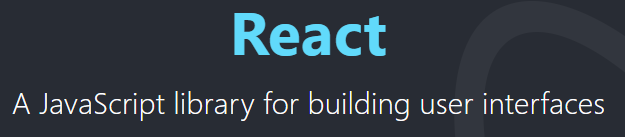
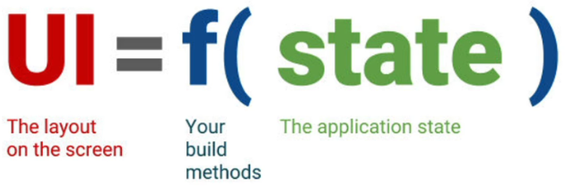
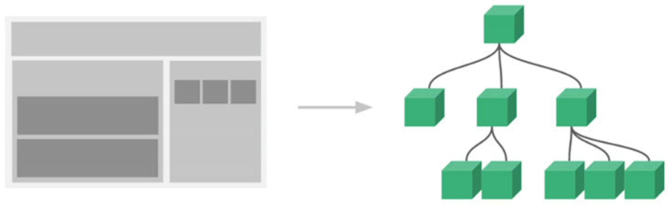
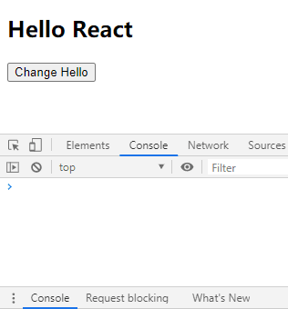

# 邂逅 React 开发

官网：https://reactjs.org/

## React 是什么？

> 我们来看一下官方对它的解释：用于构建用户界面的 JavaScript 库
>
>  

对于前段来说，主要的任务就是用于构建界面，而构建界面离不开 3 个技术：

- HTML：构建页面的结构
- CSS：构建页面的样式
- JavaScript：页面动态内容和交互

那么使用最原生的 HTML、CSS、JavaScript 可以构建完整的用户界面吗？当然可以，但是会存在很多问题，比如：

- 操作 DOM 兼容性问题；
- 过多兼容性代码的冗余问题；
- 代码组织和规范问题；

## 常见的 JavaScript 库

所以，一直以来前端开发人员都在寻求可以让自己开发更方便的 JavaScript 库：

- 在过去很长时间里，jQuery 是被使用最多的 JavaScript 库；
- 在过去的一份调查中显示，全球前 10,000 个访问最高的网站中，有 65% 使用了 jQuery，是当时最受欢迎的 JavaScript 库；
- 但是越来越多的公司开始慢慢不再使用 jQuery，包括程序员使用最多的 GitHub；

现在前端领域最为流行的是三大框架：

- Vue
- React
- Angular

> Angular 在国内并不是特别受欢迎，Vue 和 React 是国内最为流行的两个框架，他们都是帮助我们来构建用户界面的 JavaScript 库。

## React 的起源

React 是 2013 年，Facebook 开源的 JavaScript 框架，那么为什么当时 Facebook 要推出这样一款框架呢？

 

这源于一个需求所产生的 bug：

- 该功能上线之后，所产生的 bug；
- 三个消息的数字在发生变化时，过多的操作很容易产生 bug；

bug 是否可以修复呢？当然可以修复，但是 Facebook 的工程师并不满足于此；

- 他们开始思考为什么会产生这样的问题；
- 在传统的开发模式中，我们过多的去操作界面的细节（前端、iOS、Android）；
  - 并且需要掌握和使用大量 DOM 的 API，当我们可以通过 jQuery 来简化和适配一些 API 的使用；
- 另外关于数据（状态），往往会分散到各个地方，不方便管理和维护；

他们就去思考，是否有一种新的模式来解决上面的问题：

1. 以组件的方式去划分一个个功能模块
2. 组件内以 jsx 来描述 UI 的样子，以 state 来存储组件内的状态
3. 当应用的状态发生改变时，通过 setState 来修改状态，状态发生变化时，UI 会自动发生更新

## React 的特点

**声明式编程**：

- 声明式编程 是目前整个大前端开发的模式：Vue、React、Flutter、SwiftUI；
- 它允许我们只需要维护自己的状态，当状态改变时，React 可以根据最新的状态去渲染我们的 UI 界面；

 

**组件化开发：**

- 组件化开发页面目前是前端的流行趋势，我们会将复杂的界面拆分成一个个小的组件；
- 如何合理的进行组件的划分和设计也是一个重点；

 

**多平台适配：**

- 2013 年，React 发布之初主要是开发 Web 页面；

- 2015 年，Facebook 推出了 ReactNative，用于开发移动端跨平台；

  > 虽然目前 Flutter 非常火爆，但还是有很多公司在使用 ReactNative

- 2017 年，Facebook 推出 ReactVR，用于开发虚拟现实 Web 应用程序；

  > 随着 5G 的普及，VR 也会是一个火爆的应用场景

**掌握最先进的思想和技术**

React 和 Facebook 来更新和维护，它是大量优秀程序员的思想结晶：

- React 的流行不仅仅局局限于普通开发工程师对它的认可，大量流行的其他框架借鉴 React 的思想；

Vue.js 框架设计之初，有很多的灵感来自 Angular 和 React，包括 Vue3 很多新的特性，也是借鉴和学习 React，比如：

- React Hooks 是开创性的新功能；
- Vue Function Based API 学习了 React Hooks 的思想；

Flutter 的很多灵感都来自 React，来自官网的一段话：Flutter widgets are built using a modern framework that takes inspiration from React.

所以可以说 React 是前端的先驱者，它总是会引领整个前端的潮流。

# Hello React

演练 React 提出一个小的需求：

- 在界面上显示一个文本：Hello World
- 点击下方一个按钮，点击后文本改变为 Hello React

但是，使用 React 实现之前，先使用原生代码实现，这样更加方便 React 和原生作对比。

## 原生实例

> 命令式编程：每做一个操作，都是给计算机（浏览器）一步步命令

*01-hello-world.html*

```html
<!DOCTYPE html>
<html lang="en">
<head>
  <meta charset="UTF-8">
  <meta name="viewport" content="width=device-width, initial-scale=1.0">
  <title>01 Hello World</title>
</head>
<body>
  <h2 class="title">Hello World</h2>
  <button class="btn" onclick="fun(event)">Change Hello</button>
  <script>
    function fun(event) {
      console.log(event);
    }
    const message = 'Hello World';
    const titleEl = document.getElementsByClassName('title')[0];
    titleEl.innerHTML = message;

    const btnEl = document.getElementsByClassName('btn')[0];
    btnEl.addEventListener('click', e => {
      titleEl.innerHTML = 'Hello React';
      console.log('Click');
    });
  </script>
</body>
</html>
```

 

## React 开发依赖

开发 React 必须依赖 3 个库：

- react：包含 react 所必须的核心代码
- react-dom：react 渲染在不同平台所需要的核心代码
- babel：将 jsx 转换成 React 代码的工具

> 第一次接触 React 会被它繁琐的依赖高懵逼，对于 Vue 来说只依赖一个 vue.js 文件即可，但是 React 居然要依赖 3 个库。其实，这个三个库各司其职，目的就是让每一个库只单纯做自己的事情。
>
> 在 React 的 0.14 版本之前是没有 react-dom 这个概念的，所有的功能都包含在 react 里。为什么要进行拆分呢？原因就是 react-native，react 包中包含了 react 和 react-native 所共同拥有的核心代码。

react-dom 针对 web 和 native 所完成的事情不同：

- web 端：react-dom 会将 jsx 最终渲染成真实的 DOM，显示在浏览器中
- native 端：react-dom 会将 jsx 最终渲染成原生的控件（比如：Android 中的 Button、IOS 中的 UIButton）

## 认识 babel

**babel 是什么呢？**

- Babel，又名 **Babel.js**
- 是目前前端使用非常广泛的编辑器、转译器。
- 比如当下很多浏览器并不支持 ES6 的语法，但是确实 ES6 的语法非常的简洁和方便，我们**开发时**希望使用它。
- 那么编写源码时我们就可以使用 ES6 来编写，之后通过 Babel 工具，将 ES6 转成大多数浏览器都支持的 ES5 的语法。

React 和 Babel 的关系：

- 默认情况下开发 React 其实可以不使用 babel
- 但是前提是我们自己使用 React.createElement 来编写源代码，它编写的代码非常的繁琐而且可读性差。
- 那么我们就可以直接编写 jsx（JavaScript XML）的语法，并且让 babel 帮助我们转换成 React.createElement。

## 引入 React 依赖

所以在编写 React 代码时，这 3 个依赖都是必不可少的，那么如何添加这 3 个依赖：

- 方式一：直接 CDN 引入
- 方式二：下载后，添加本地依赖
- 方式三：通过 npm 管理（脚手架）

暂时我们直接通过 CDN 引入，来演练下面的示例程序：

> 官网：https://reactjs.org/docs/add-react-to-a-website.html
>
> 这里有一个 crossorigin 的属性，这个属性的目的是为了拿到跨域脚本的错误信息

```html
<!-- Load React. -->
<!-- Note: when deploying, replace "development.js" with "production.min.js". -->

<!-- Development -->
<script src="https://unpkg.com/react@16/umd/react.development.js" crossorigin></script>
<script src="https://unpkg.com/react-dom@16/umd/react-dom.development.js" crossorigin></script>

<!-- Production -->
<script src="https://unpkg.com/react@16/umd/react.production.min.js" crossorigin></script>
<script src="https://unpkg.com/react-dom@16/umd/react-dom.production.min.js" crossorigin></script>

<!-- Quickly Try JSX -->
<script src="https://unpkg.com/babel-standalone@6/babel.min.js"></script>
```

*02-hello-world-react.html*

```react
<!DOCTYPE html>
<html lang="en">

<head>
  <meta charset="UTF-8">
  <meta name="viewport" content="width=device-width, initial-scale=1.0">
  <title>02 Hello World React</title>
  <script src="https://unpkg.com/react@16/umd/react.development.js" crossorigin></script>
  <script src="https://unpkg.com/react-dom@16/umd/react-dom.development.js" crossorigin></script>
  <!-- Quickly Try JSX -->
  <script src="https://unpkg.com/babel-standalone@6/babel.min.js"></script>
  <!-- My Code -->
  <script type="text/babel">

    let message = 'Hello World';
    render();

    function btnClick() {
      message = 'Hello React';
      console.log('btnClick', message);
      // 重新渲染
      render();
    }

    function render() {
      // react-dom.development.js
      ReactDOM.render(
        // jsx：只能有一个根标签
        <div>
          <h2>{message}</h2>
          <button onClick={btnClick}>Change Hello</button>
        </div>
        ,
        document.getElementById('app')
      );
    }
  </script>
</head>

<body>
  <div id="app"></div>
</body>

</html>
```

*02-hello-world-react-component.html*

```react
<!DOCTYPE html>
<html lang="en">

<head>
  <meta charset="UTF-8">
  <meta name="viewport" content="width=device-width, initial-scale=1.0">
  <title>02 Hello World React Component</title>
  <script src="https://unpkg.com/react@16/umd/react.development.js" crossorigin></script>
  <script src="https://unpkg.com/react-dom@16/umd/react-dom.development.js" crossorigin></script>
  <script src="https://unpkg.com/babel-standalone@6/babel.min.js"></script>
  <!-- My Code -->
  <script type="text/babel">

    // 封装 App 组件
    class App extends React.Component {

      constructor() {
        super();
        // this.message = 'Hello World';
        this.state = {
          message: 'Hello World'
        };
      }

      render() {
        return (
          <div>
            <h2>{this.state.message}</h2>
            <button onClick={this.btnClick.bind(this)}>Charge Hello</button>
          </div>
        );
      }

      btnClick() {
        // 修改数据 并重新渲染
        this.state.message = 'Hello React';
        this.setState(this.state);
        // this --> undefined
        console.log('btnClick', this, this.state.message);
      }
    }

    const app = document.getElementById('app');
    // 渲染组件
    ReactDOM.render(<App/>, app);
  </script>
</head>

<body>
  <div id="app"></div>
</body>

</html>
```

